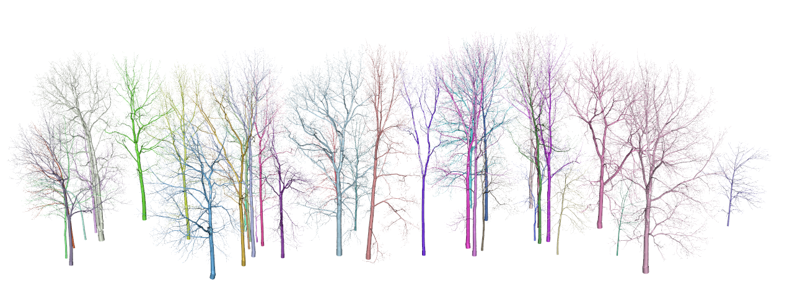

<!-- README.md is generated from README.Rmd. Please edit that file -->

```{r, include = FALSE}
knitr::opts_chunk$set(
  collapse = TRUE,
  comment = "#>",
  fig.path = "man/figures/README",
  out.width = "100%"
)
```

# rTwig 

<!-- badges: start -->

[](https://cran.r-project.org/package=rTwig)

[](https://github.com/aidanmorales/rTwig/actions/workflows/R-CMD-check.yaml)

[](https://github.com/aidanmorales/rTwig/commits/main)


<!-- badges: end -->

## Description

Real Twig is a method to correct unrealistic cylinders in quantitative structure models (QSMs), especially overestimated small branch and twig cylinders. Real Twig is different than traditional allometric or statistical corrections. Real Twig uses real twig diameter measurements from corresponding tree species to inform individual branch taper models. Real Twig dynamically identifies realistic cylinders in a QSM using network analysis, general additive models, and real twig measurements, to model and correct unrealistic cylinders with a high degree of precision and accuracy when vetted against ground truth reference data.

Real Twig does much more than correct QSM cylinder radii. Real Twig includes tools for QSM visualization and analysis that are seamlessly compatible with base R and popular packages such as the Tidyverse. Real Twig also includes fast, vectorized functions for point cloud fractal analysis and visualization using the box-dimension metric. Also included is a novel database of twig diameter measurements for many common North American and European trees, on both the species and genus level.



## Functions

-   `import_qsm()` imports a QSM created by TreeQSM (.mat)
-   `update_cylinders()` updates cylinder relationships and adds new QSM variables
-   `correct_radii` models QSM paths and corrects cylinder radii
-   `qsm_summary()` summarizes QSM diameter, height, volume, and surface area
-   `smooth_qsm()` connects cylinder end-to-end to smooth branch visualization
-   `plot_qsm()` plots an individual QSM optionally with its point cloud
-   `plot_stand()` plots multiple QSMs optionally with their point cloud
-   `export_mesh()` exports a QSM as a mesh object (.ply)
-   `export_mat()` exports a QSM in a MATLAB format (.mat)
-   `box_dimension()` calculates and visualizes the structural complexity of a point cloud

## Installation

You can install the released version of `rTwig` from [CRAN](https://CRAN.R-project.org) with:

``` r
install.packages("rTwig") # placeholder for CRAN release. 
```

You can install the development version of `rTwig` from [GitHub](https://github.com/) with:

``` r
# install.packages("devtools")
devtools::install_github("aidanmorales/rTwig")
```

### Quick Start: QSM Radii Correction

QSM radii corrections are run as a chain of function that build on one another. The general processing chain is as follows:

1.  Import a QSM: TreeQSM and SimpleForest are currently supported.
2.  Update the cylinder data to allow for network analysis and growth length calculations.
3.  Correct the small branch and twig cylinders using real twig diameter measurements.
4.  Summarize and visualize the results.

Below are examples of how to quickly run Real Twig on TreeQSM and SimpleForest QSMs, using example data from the package. See the vignettes for more details on a general workflow and best practices.

#### TreeQSM

``` r
 # Load the Real Twig library
 library(rTwig)
 
 # Import a TreeQSM
 file <- system.file("extdata/QSM.mat", package = "rTwig")
 qsm <- import_qsm(file)
 
 # Correct the cylinders
 qsm$cylinder <- update_cylinders(qsm$cylinder)
 qsm$cylinder <- correct_radii(qsm$cylinder, twigRad = 4.23)
 
 # Plot the result
 plot_qsm(qsm$cylinder)
```

#### SimpleForest

``` r
 library(rTwig)
 
 # Import a SimpleForest QSM 
 file <- system.file("extdata/QSM.csv", package = "rTwig")
 qsm <- read.csv(file)
 
 # Correct the cylinders
 qsm <- update_cylinders(qsm)
 qsm <- correct_radii(qsm, twigRad = 4.23)
 
 # Plot the result
 plot_qsm(qsm)
```

### Quick Start: Box Dimension

Below is an example of how to quickly calculate box-dimension on a point cloud using example data from the package. See the vignette for more details and explanation.

``` r
# Load a point cloud
file <- system.file("extdata/cloud.txt", package = "rTwig")
cloud <- read.table(file)

# Calculate box-dimension
output <- box_dimension(cloud)
output[[2]]$slope
```


