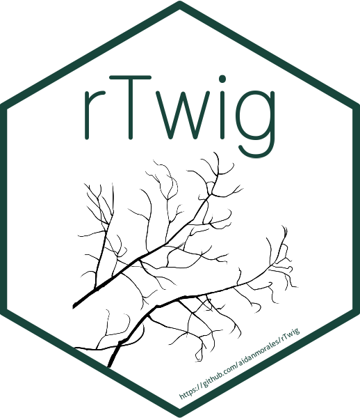

<!-- README.md is generated from README.Rmd. Please edit that file -->
<!-- badges: start -->

[](https://github.com/aidanmorales/rTwig/actions/workflows/R-CMD-check.yaml)

<!-- badges: end -->

# rTwig



## Description

Official repository for the rTwig package. The Real Twig method corrects
overestimated cylinder radii in QSMs. Real Twig is different than
traditional allometric corrections because it uses real twig
measurements from real trees to inform branch tapering, and it
dynamically identifies unique allometry and corrects incorrect allometry
within a QSM using network analysis and general additive models. Also
included are tools for QSM visualization, point cloud fractal analysis,
and a database of twig diameter measurements for many common tree
species.

## Installation

You can install the released version of rTwig from
[CRAN](https://CRAN.R-project.org) with:

``` r
install.packages("rTwig") # placeholder for potential CRAN release. 
```

You can install the development version from
[GitHub](https://github.com/) with:

``` r
# install.packages("devtools")
devtools::install_github("aidanmorales/rTwig")
```

## QSM Radii Correction

Real twig is run as a chain of function that build on one another. The
general processing chain is as follows:

1.  Import a QSM: TreeQSM and SimpleForest are currently supported.
2.  Update the cylinder data to allow for network analysis and growth
    length calculations.
3.  Correct the small branch and twig cylinders using real twig radii
    measured in millimeters.
4.  Summarize, visualize and export the results.

### TreeQSM

rTwig currently supports all versions of TreeQSM. However, older
versions of TreeQSM store the data in a different format. The user can
specify which version of TreeQSM they are using with the `version`
parameter in the `import_qsm` function. rTwig uses the new TreeQSM
format by default, but the older format can be imported with
`version = "2.0"`. `import_qsm` also imports all QSM information,
including cylinder, branch, treedata, rundata, pmdistance, and
triangulation data.

#### TreeQSM v2.3.0 - 2.4.1

``` r
 library(rTwig)
 
 # Import a QSM MATLAB file
 file <- system.file("extdata/QSM.mat", package = "rTwig")
 qsm <- import_qsm(file)
 
 # Correct the QSM cylinders
 cylinder <- qsm$cylinder
 cylinder <- update_cylinders(cylinder)
 cylinder <- growth_length(cylinder)
 cylinder <- correct_radii(cylinder, twigRad = 1.5)
 cylinder <- smooth_qsm(cylinder)
 
 # Plot the result
 plot_qsm(cylinder)
```

#### TreeQSM v2.0

``` r
 library(rTwig)
 
 # Import a QSM MATLAB file
 file <- system.file("extdata/QSM2.mat", package = "rTwig")
 qsm <- import_qsm(file, version = "2.0")
 
 # Correct the QSM cylinders
 cylinder <- qsm$cylinder
 cylinder <- update_cylinders(cylinder)
 cylinder <- growth_length(cylinder)
 cylinder <- correct_radii(cylinder, twigRad = 1.5)
 cylinder <- smooth_qsm(cylinder)
 
 # Plot the result
 plot_qsm(cylinder)
```

### SimpleForest

``` r
 library(rTwig)
 
 # Import a SimpleForest QSM csv file
 file <- system.file("extdata/QSM.csv", package = "rTwig")
 cylinder <- read.csv(file)
 
 # Correct the QSM cylinders
 cylinder <- update_cylinders(cylinder)
 cylinder <- correct_radii(cylinder, twigRad = 1.5)
 
 # Plot the result
 plot_qsm(cylinder)
```

## Box Dimension

rTwig can also calculate box dimenstion on point clouds. The box
dimension is the measure of the structural complexity of an object. The
box dimension of point clouds can be easily calculated as follows:

``` r
# Calculate Box Dimension
file <- system.file("extdata/cloud.txt", package = "rTwig")

cloud <- read.table(file)

output <- box_dimension(cloud)
output

# Plot Results
data <- output[[1]]
plot(data$log.box.size,
  data$log.voxels,
  pch = 19,
  xlab = "Log(Inverse Box Size)",
  ylab = "log(Box Count)"
)
abline(lm(data$log.voxels ~ data$log.box.size))
```
