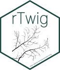
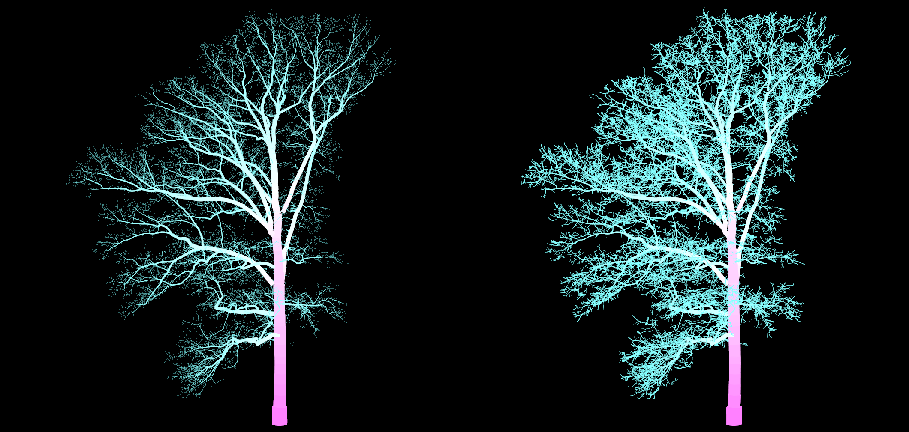
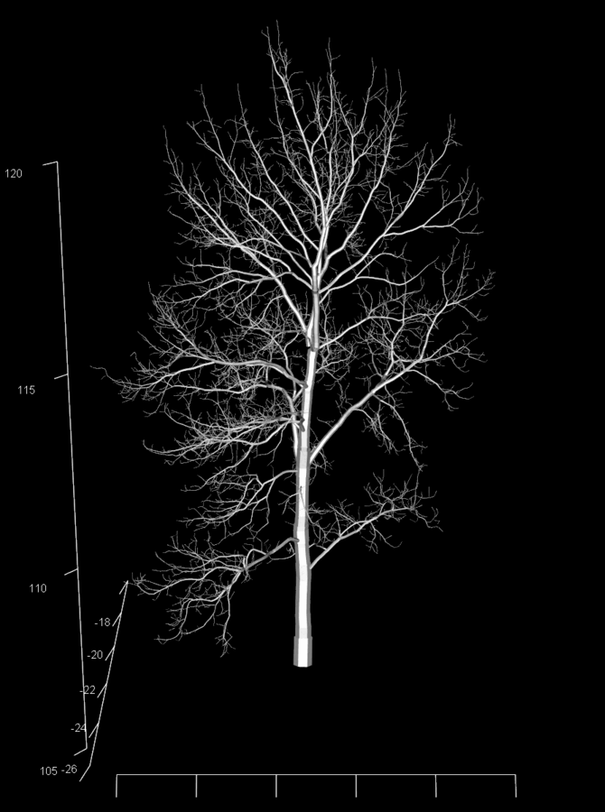
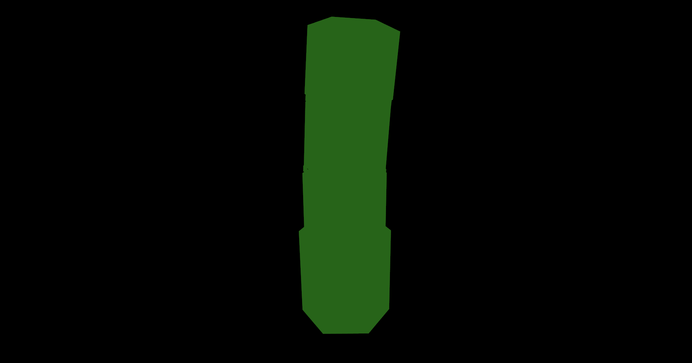
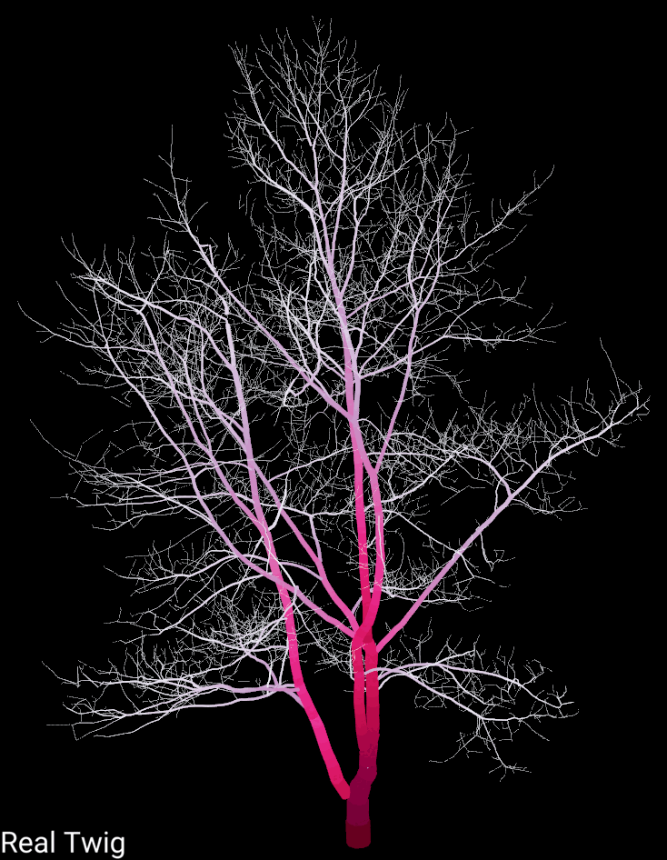
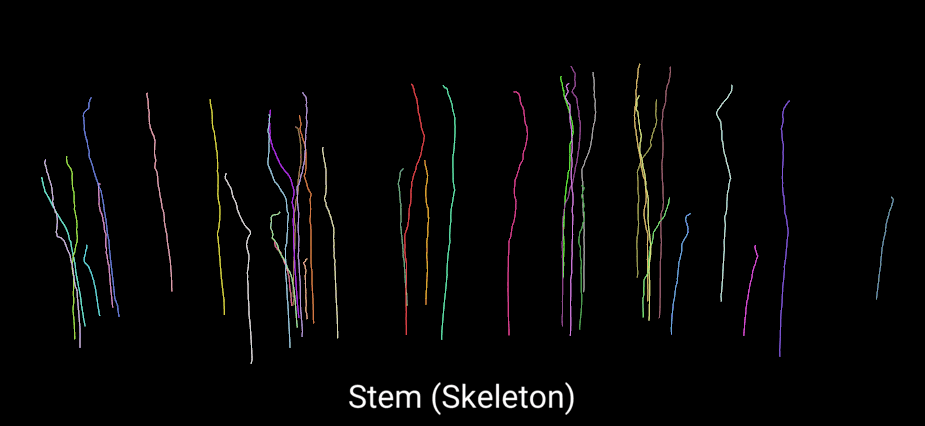
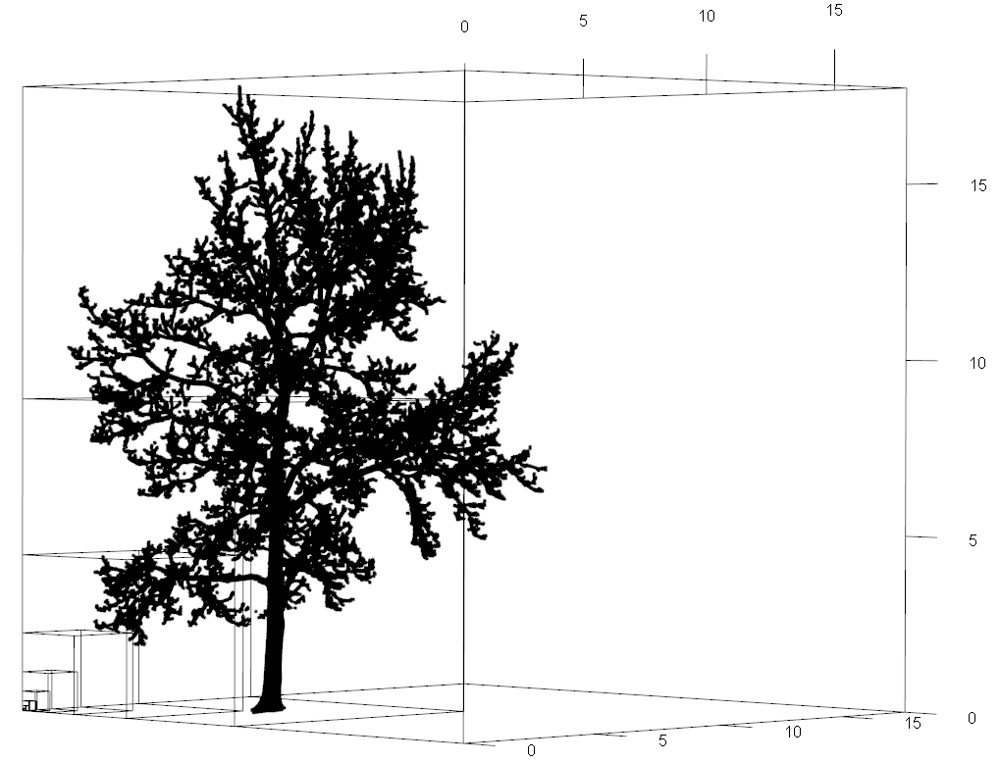

<!-- README.md is generated from README.Rmd. Please edit that file -->

# rTwig 

<!-- badges: start -->

[](https://cran.r-project.org/package=rTwig)
[](https://aidanmorales.r-universe.dev)
[](https://github.com/aidanmorales/rTwig/actions/workflows/R-CMD-check.yaml)
[](https://github.com/aidanmorales/rTwig/commits/main)
[](https://cran.r-project.org/package=rTwig)
[](https://cran.r-project.org/package=rTwig)
[-orchid.svg)](https://cran.r-project.org/web/licenses/GPL-3)

<!-- badges: end -->

## Description

Real Twig is a method to correct unrealistic cylinders in quantitative
structure models (QSMs), different than traditional allometric or
statistical corrections. Small branch and twig cylinders are
overestimated in QSMs due to technical limitations in current LiDAR
sensor technology. Real Twig overcomes these limitations by using real
and direct twig diameter measurements from corresponding tree species to
inform individual path taper models in a QSM. Real Twig dynamically
identifies realistic cylinders in a QSM using network analysis, general
additive models, and direct twig measurements, to model and correct
unrealistic cylinders with a high degree of precision and accuracy when
vetted against ground truth reference data. The Real Twig method is
presented here as the R package, rTwig.

rTwig includes a novel database of twig diameter measurements for many
common North American and European trees, to make the method immediately
accessible to the user. In addition, rTwig includes fast and efficient
tools for QSM visualization and analysis that are seamlessly compatible
with the R ecosystem, and for point cloud fractal analysis and
visualization using the box-dimension metric.

## Method

A complete description and validation of Real Twig can be read here:

**Aidan Morales**, and **David W. MacFarlane**. “Reducing tree volume
overestimation in quantitative structure models using modeled branch
topology and direct twig measurements.” *Forestry: An International
Journal of Forest Research*, 2024, pp. 1-16.
<https://doi.org/10.1093/forestry/cpae046>.

## Features

#### Realistic Trees

The main goal of Real Twig was to correct volume overestimation in QSMs
caused by the limitations of LiDAR sensors for better non-destructive
above ground biomass (AGB) estimates. Real Twig incorporates direct twig
measurement into the QSM, resulting in models that not only have
accurate volume metrics, but are also visually realistic, independent of
tree species or size. For example, shown below is a 300+ year old white
oak tree (*Quercus alba*), with and without Real Twig.



#### Efficient Visualization

`plot_qsm()` can plot QSMs and point clouds, using `rgl` as the 3D
display, and C++ via `Rcpp` to efficiently build the cylinders. The
cylinders, simulated point cloud, and skeleton can all be plotted and
colored by any variable or user supplied color palette. It can also
visualize stem triangulation meshes from TreeQSM.

|                               |                                   |
|-------------------------------|-----------------------------------|
|  |      |
|   |  |

#### Detailed Tree Metrics

The goal of rTwig was to provide users with tools to visualize and
analyze QSM metrics without being tied to any particular QSM software.
To that end, `standardize_qsm()` provides a consistent naming convention
between supported QSMs, making it easy to combine and analyze QSMs from
different sources. `tree_metrics()` calculates all of the major QSM
metrics between all supported software. `prune_qsm()` can virtually
prune a tree using multiple input parameters. `cluster_cloud()` can
transfer all QSM metrics directly onto an unorganized point cloud, or
simulate a virtual point cloud. See the vignettes or function reference
pages for more details.

#### Supported Software

rTwig currently supports
[TreeQSM](https://github.com/InverseTampere/TreeQSM),
[SimpleForest](https://www.simpleforest.org/),
[Treegraph](https://github.com/wanxinyang/treegraph), and
[aRchi](https://github.com/umr-amap/aRchi)

## Functions

- `run_rtwig()` runs the Real Twig method on a QSM
- `import_qsm()` imports a QSM created by TreeQSM (.mat)
- `import_treegraph()` imports a QSM created by Treegraph (.json)
- `standardize_qsm()` standardizes QSM variable names across supported
  software
- `update_cylinders()` updates cylinder relationships and adds new QSM
  variables
- `correct_radii()` models QSM paths and corrects cylinder radii
- `tree_metrics()` generates detailed tree metrics and a simulated point
  cloud
- `cluster_cloud()` transfers QSM variables to a point cloud or
  simulates a point cloud
- `qsm_summary()` summarises QSM diameter, height, volume, and surface
  area
- `smooth_qsm()` connects cylinder end-to-end to smooth branch
  visualization
- `plot_qsm()` plots QSMs and optionally their point clouds
- `prune_qsm()` prunes a QSM by cylinder attributes, height, or diameter
  classes
- `export_mesh()` exports a QSM as a mesh object (.ply)
- `export_mat()` exports a QSM in a MATLAB format (.mat)
- `box_dimension()` calculates and visualizes the structural complexity
  of a point cloud

## Installation

You can install the released version of `rTwig` from
[CRAN](https://cran.r-project.org/package=rTwig) with:

``` r
install.packages("rTwig")
```

You can install the development version of `rTwig` from
[GitHub](https://github.com/aidanmorales/rTwig) with:

``` r
# install.packages("devtools")
devtools::install_github("aidanmorales/rTwig")
```

### Quick Start: Real Twig

Below are examples of how to quickly run and visualize Real Twig, using
example data from the package. See the vignettes for more details on a
general workflow and best practices.

#### TreeQSM

``` r
 # Load the Real Twig library
 library(rTwig)
 
 # File path to QSM
 file <- system.file("extdata/QSM.mat", package = "rTwig")
 
 # Correct QSM cylinders
 qsm <- run_rtwig(file, twig_radius = 4.23)
 
 # Plot the result
 plot_qsm(qsm$cylinder)
 
 # View detailed tree metrics
 qsm$metrics
```

#### SimpleForest

``` r
 # Load the Real Twig library
 library(rTwig)
 
 # File path to QSM
 file <- system.file("extdata/QSM.csv", package = "rTwig")
 
 # Correct QSM cylinders
 qsm <- run_rtwig(file, twig_radius = 4.23)
 
 # Plot the result
 plot_qsm(qsm$cylinder)
 
 # View detailed tree metrics
 qsm$metrics
```

#### Treegraph

``` r
 # Load the Real Twig library
 library(rTwig)
 
 # File path to QSM
 file <- "path_to_treegraph_json"
 
 # Correct QSM cylinders
 qsm <- run_rtwig(file, twig_radius = 4.23)
 
 # Plot the result
 plot_qsm(qsm$cylinder)
 
 # View detailed tree metrics
 qsm$metrics
```

#### aRchi

``` r
 # Load the Real Twig library
 library(rTwig)
 
 # File path to QSM
 file <- system.file("extdata/QSM2.csv", package = "rTwig")
 
 # Correct QSM cylinders
 qsm <- run_rtwig(file, twig_radius = 4.23)
 
 # Plot the result
 plot_qsm(qsm$cylinder)
 
 # View detailed tree metrics
 qsm$metrics
```

### Quick Start: Fractal Analysis

rTwig also includes an efficient function written in C++ via `Rcpp` for
fractal analysis using the voxel-counting method. Below is an example of
how to quickly calculate box-dimension on a point cloud using example
data from the package. See the vignette for more details and
explanation.

``` r
# Load a point cloud
file <- system.file("extdata/cloud.txt", package = "rTwig")
cloud <- read.table(file)

# Calculate box-dimension
output <- box_dimension(cloud)
output[[2]]$slope
```


