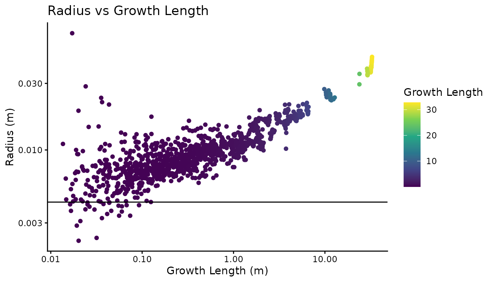
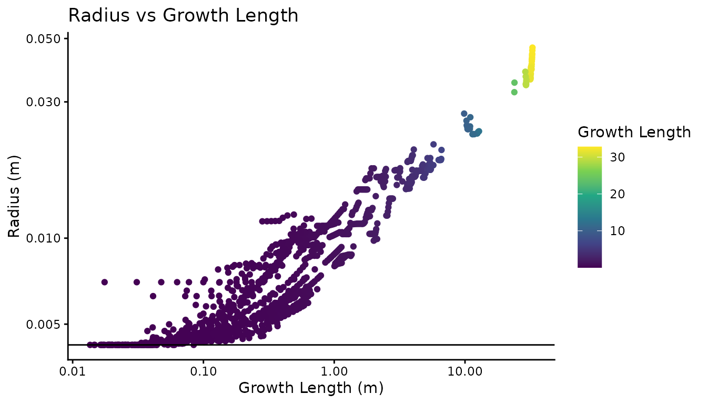

# Overview

## Background

Real Twig was designed and tested using QSMs created with the
[TreeQSM](https://github.com/InverseTampere/TreeQSM) modeling software.
If high quality point clouds, QSMs with the proper input settings, and
species specific twig diameter measurements are supplied, you can expect
to get very good estimates of tree volume within ± 10% of the real tree
volume.

If any given QSM provides parent-child cylinder relationships, Real Twig
will work, as is the case of the
[SimpleForest](https://www.simpleforest.org/),
[Treegraph](https://github.com/wanxinyang/treegraph/tree/master), and
[aRchi](https://github.com/umr-amap/aRchi) software packages. If high
quality point clouds, QSMs with the proper input settings, and species
specific twig diameter measurements are supplied, you can expect to get
good estimates of tree volume across multiple different software
packages.

While Real Twig can provide excellent tree volume estimates, it can not
transform poor quality data into good data. As a general rule of thumb,
the closer the QSM resembles the actual tree before correction, the
better the results will be after correction. Real Twig performs best
when the topology of the tree is correct, and only the cylinder sizes
are the main sources of QSM error. Errors in QSM topology become readily
apparent after correction, so Real Twig can also be used to visually
validate QSM topology without reference data.

## Installation

You can install the package directly from
[CRAN](https://CRAN.R-project.org):

``` r
install.packages("rTwig")
```

Or the latest development version from [GitHub](https://github.com/):

``` r
devtools::install_github("https://github.com/aidanmorales/rTwig")
```

## Load Packages

The first step is to load the rTwig package. Real Twig works well when
paired with packages from the [Tidyverse](https://www.tidyverse.org/),
so we will also load the dplyr package to help with data manipulation.

``` r
# Load rTwig
library(rTwig)

# Other useful packages
library(dplyr)
```

## Import QSM

rTwig supports all available versions of TreeQSM, from *v2.0* to
*v2.4.1* at the time of writing. It is important to note that legacy
versions of TreeQSM (*v2.0*) store data in a much different format than
modern versions (*v2.3.0-2.4.1*). It is strongly advised to use the
latest version of TreeQSM with rTwig for the best QSM topology and
volume estimates. Older versions can be used, but the QSM topology is
poor, and volume underestimation is almost guaranteed.

Regardless of the version of TreeQSM or MATLAB used, the
[`import_treeqsm()`](https://aidanmorales.github.io/rTwig/reference/import_treeqsm.md)
function will import a QSM (.mat extension) and convert the data to a
format usable by R. The user must specify which version of TreeQSM they
are using with the `version` parameter. rTwig automatically defaults to
use the new TreeQSM format, so the older format can be imported with
`version = "2.0"`.
[`import_treeqsm()`](https://aidanmorales.github.io/rTwig/reference/import_treeqsm.md)
also imports all QSM information, including cylinder, branch, treedata,
rundata, pmdistance, and triangulation data, which are stored together
as a list.

SimpleForest exports its QSMs as .csv files, so they are easy to load
into R using the built in
[`read.csv()`](https://rdrr.io/r/utils/read.table.html) function. If the
QSM contains thousands of cylinders, it is much faster to use the
`fread()` function from the `data.table` package to take advantage of
multi-threaded support.

Treegraph exports its QSMs as .json files. To import them into R, we can
use the
[`import_treegraph()`](https://aidanmorales.github.io/rTwig/reference/import_treegraph.md)
function to quickly load in a Treegraph QSM.

aRchi is built in R, so there is no provided function to import the
data. Users can extract the aRchi cylinder data with `aRchi::get_QSM()`
before running the rTwig functions.

#### Example 1: TreeQSM v2.3.0 - 2.4.1

We can import a QSM by supplying the
[`import_treeqsm()`](https://aidanmorales.github.io/rTwig/reference/import_treeqsm.md)
function the directory to our QSM.

``` r
# QSM directory
file <- system.file("extdata/QSM.mat", package = "rTwig")

# Import and save QSM
qsm <- import_treeqsm(file)
```

The QSM should be a list with six elements. We can check it as follows:

``` r
summary(qsm)
#>               Length Class      Mode
#> cylinder      17     data.frame list
#> branch        10     data.frame list
#> treedata      91     -none-     list
#> rundata       45     data.frame list
#> pmdistance    21     -none-     list
#> triangulation 12     -none-     list
```

Let’s check what version of TreeQSM was used, the date the QSM was made,
and take a look at the cylinder data.

``` r
# QSM info
qsm$rundata$version
#> [1] "2.4.1"
qsm$rundata$start.date
#> [1] "2023-12-06 10:14:31 UTC"

# Number of cylinders
str(qsm$cylinder)
#> 'data.frame':    1136 obs. of  17 variables:
#>  $ radius          : num  0.0465 0.0454 0.0442 0.0437 0.0429 ...
#>  $ length          : num  0.09392 0.07216 0.06654 0.00938 0.06795 ...
#>  $ start.x         : num  0.768 0.768 0.768 0.769 0.769 ...
#>  $ start.y         : num  -16.4 -16.4 -16.4 -16.3 -16.3 ...
#>  $ start.z         : num  254 254 254 254 254 ...
#>  $ axis.x          : num  0.00995 -0.0111 0.01364 0.01571 0.01449 ...
#>  $ axis.y          : num  0.0912 0.0391 0.0367 0.0271 0.0267 ...
#>  $ axis.z          : num  0.996 0.999 0.999 1 1 ...
#>  $ parent          : int  0 1 2 3 4 5 6 7 8 9 ...
#>  $ extension       : int  2 3 4 5 6 7 8 9 10 11 ...
#>  $ added           : num  0 0 0 0 0 0 0 0 0 0 ...
#>  $ UnmodRadius     : num  0.0465 0.0454 0.0442 0.0437 0.0429 ...
#>  $ branch          : int  1 1 1 1 1 1 1 1 1 1 ...
#>  $ SurfCov         : num  0.875 1 1 1 1 1 1 1 1 1 ...
#>  $ mad             : num  0.00072 0.000538 0.000523 0.000335 0.000438 ...
#>  $ BranchOrder     : int  0 0 0 0 0 0 0 0 0 0 ...
#>  $ PositionInBranch: int  1 2 3 4 5 6 7 8 9 10 ...
```

#### Example 2: TreeQSM v2.0

Let’s try importing an old QSM and check its structure.

``` r
# QSM Directory
file <- system.file("extdata/QSM_2.mat", package = "rTwig")

# Import and save QSM
qsm2 <- import_treeqsm(file, version = "2.0")

# QSM Info
summary(qsm2)
#>          Length Class      Mode
#> cylinder 15     data.frame list
#> treedata 33     -none-     list
str(qsm2$cylinder)
#> 'data.frame':    1026 obs. of  15 variables:
#>  $ radius          : num  0.0612 0.056 0.0553 0.0552 0.0534 ...
#>  $ length          : num  0.335 0.283 0.272 0.244 0.267 ...
#>  $ start.x         : num  8.4 8.43 8.44 8.47 8.5 ...
#>  $ start.y         : num  47.7 47.7 47.7 47.8 47.8 ...
#>  $ start.z         : num  2.23 2.57 2.85 3.12 3.36 ...
#>  $ axis.x          : num  0.1103 0.0531 0.0878 0.1666 0.0894 ...
#>  $ axis.y          : num  0.0337 0.0296 0.1282 0.0801 0.061 ...
#>  $ axis.z          : num  0.993 0.998 0.988 0.983 0.994 ...
#>  $ parent          : num  0 1 2 3 4 5 6 7 8 9 ...
#>  $ extension       : num  1 2 3 4 5 6 7 8 9 10 ...
#>  $ added           : int  0 0 0 0 0 0 0 0 0 0 ...
#>  $ UnmodRadius     : num  0.0612 0.056 0.0553 0.0552 0.0534 ...
#>  $ branch          : num  1 1 1 1 1 1 1 1 1 1 ...
#>  $ BranchOrder     : num  0 0 0 0 0 0 0 0 0 0 ...
#>  $ PositionInBranch: num  1 2 3 4 5 6 7 8 9 10 ...
```

#### Example 3: SimpleForest

``` r
# QSM directory
file <- system.file("extdata/QSM.csv", package = "rTwig")

# Import and save QSM cylinder data
cylinder <- read.csv(file)
```

Let’s take a look at the SimpleForest cylinder data.

``` r
str(cylinder)
#> 'data.frame':    1149 obs. of  17 variables:
#>  $ ID                  : int  0 1 2 3 4 5 6 7 8 9 ...
#>  $ parentID            : int  -1 0 1 2 3 4 5 6 7 8 ...
#>  $ startX              : num  0.761 0.759 0.771 0.768 0.765 ...
#>  $ startY              : num  -16.4 -16.4 -16.4 -16.3 -16.4 ...
#>  $ startZ              : num  254 254 254 254 254 ...
#>  $ endX                : num  0.759 0.771 0.768 0.765 0.769 ...
#>  $ endY                : num  -16.4 -16.4 -16.3 -16.4 -16.4 ...
#>  $ endZ                : num  254 254 254 254 254 ...
#>  $ radius              : num  0.0472 0.0479 0.0469 0.0467 0.0453 ...
#>  $ length              : num  0.0497 0.0529 0.0535 0.0525 0.0528 ...
#>  $ growthLength        : num  31.4 31.4 31.3 31.3 31.2 ...
#>  $ averagePointDistance: num  0.00589 0.00378 0.00205 0.00246 0.00251 ...
#>  $ segmentID           : int  0 0 0 0 0 0 0 0 0 0 ...
#>  $ parentSegmentID     : int  -1 -1 -1 -1 -1 -1 -1 -1 -1 -1 ...
#>  $ branchOrder         : int  0 0 0 0 0 0 0 0 0 0 ...
#>  $ reverseBranchOrder  : int  18 18 18 18 18 18 18 18 18 18 ...
#>  $ branchID            : int  0 0 0 0 0 0 0 0 0 0 ...
```

## Cylinder Data

Next, we have to update the parent-child ordering in the cylinder data
to allow for path analysis and add some new QSM variables. The most
important QSM variable is growth length. Growth length is a cumulative
length metric, where the growth length of a cylinder is its length, plus
the lengths of all of its children. This gives us perfect ordering along
a branch or a path, where the highest growth length is equal to the base
of the tree, and twigs have a growth length equal to their cylinder
length. It is also important to note that the number of twigs in a QSM
is always equal to the number of paths in a QSM, since a path goes from
the base of the tree to a twig tip.

We also calculate several additional variables to improve QSM analysis
and visualization. The reverse branch order (RBO) assigns an order of 1
to the twigs, and works backwards to the base of the main stem, which
has the highest RBO. The RBO is essentially the maximum node depth for
any given branch segment (the area between branching forks). RBO
problematic twig cylinders easy to identify. The distance from each
cylinder to the base, and the average distance from each cylinder to all
supported twigs are new ways to help visualize problematic cylinders.

Let’s save the cylinders to a new variable to make it easier to work
with and update the ordering.

``` r
# Save cylinders to new object
cylinder <- qsm$cylinder

# Update cylinder data
cylinder <- update_cylinders(cylinder)
```

## Topology

Before we correct the QSM, it is often worthwhile to check the quality
of the QSM by plotting it against its input point cloud. To do this, we
load the point cloud and save it as a data frame, with the first three
columns as the x, y, and z columns. We use the
[`plot_qsm()`](https://aidanmorales.github.io/rTwig/reference/plot_qsm.md)
function to do this. We want to check the raw cylinder fits before any
possible modification, so we will will use the raw cylinder radii.

``` r
# Load the input point cloud
file <- system.file("extdata/cloud.txt", package = "rTwig")
cloud <- read.table(file, header = FALSE)

# Plot the qsm and point cloud
plot_qsm(cylinder = cylinder, cloud = cloud, radius = "UnmodRadius")
```

## Twig Diameters

Before we can correct the QSM radii, we need to know what our real twig
diameter is. For this example tree, the species is a Kentucky coffee
tree (*Gymnocladus dioicus*), which has nice, stout twigs. rTwig comes
with a data base of twigs that can be called by typing in the `twigs`
data set. The data set includes the average twig radius, the min and max
radius, the standard deviation, and the coefficient of variation. Let’s
look at the twig data set and find the twig diameter for Kentucky coffee
tree.

``` r
# Look at the twigs database
twigs
#> # A tibble: 104 × 7
#>    scientific_name  radius_mm     n   min   max   std    cv
#>    <chr>                <dbl> <dbl> <dbl> <dbl> <dbl> <dbl>
#>  1 Abies concolor        1.43    21  0.89  1.9   0.28  0.19
#>  2 Abies spp.            1.43    21  0.89  1.9   0.28  0.19
#>  3 Acer platanoides      1.39    30  0.89  2.03  0.3   0.21
#>  4 Acer rubrum           1.18    30  0.89  1.52  0.16  0.14
#>  5 Acer saccharinum      1.41    14  0.89  1.9   0.27  0.2 
#>  6 Acer saccharum        1.2     30  0.89  1.65  0.23  0.19
#>  7 Acer spp.             1.29   104  0.89  2.03  0.23  0.18
#>  8 Aesculus flava        2.96    14  2.29  4.44  0.58  0.19
#>  9 Aesculus spp.         2.96    14  2.29  4.44  0.58  0.19
#> 10 Betula nigra          0.85    30  0.51  1.52  0.23  0.27
#> # ℹ 94 more rows

# Find our species
filter(twigs, scientific_name == "Gymnocladus dioicus")
#> # A tibble: 1 × 7
#>   scientific_name     radius_mm     n   min   max   std    cv
#>   <chr>                   <dbl> <dbl> <dbl> <dbl> <dbl> <dbl>
#> 1 Gymnocladus dioicus      4.23    30  2.79   6.6  0.87   0.2
```

## Summary Metrics

Before we correct the QSM, Let’s take a look at the current metrics, so
we can compare the tree volume before and after correction. We can do
this with the
[`summarise_qsm()`](https://aidanmorales.github.io/rTwig/reference/summarise_qsm.md)
function. If stem triangulation was enabled in TreeQSM, we can use it to
better represent the main stem volume in some cases, especially when
there are large buttress flares. We can also make a plot of the radius
versus the growth length to see how much overestimation there is in the
twig radii.

``` r
# QSM summary with Triangulation
summarise_qsm(cylinder = cylinder, radius = radius, triangulation = qsm$triangulation)[c(2:3)]
#> [[1]]
#> # A tidytable: 1 × 8
#>   dbh_qsm_cm tree_height_m stem_volume_L branch_volume_L tree_volume_L
#>        <dbl>         <dbl>         <dbl>           <dbl>         <dbl>
#> 1       7.18          3.69          10.8            11.4          22.2
#> # ℹ 3 more variables: stem_area_m2 <dbl>, branch_area_m2 <dbl>,
#> #   tree_area_m2 <dbl>
#> 
#> [[2]]
#> # A tidytable: 1 × 8
#>   dbh_tri_cm tri_volume_L stem_mix_volume_L tree_mix_volume_L tri_area_m2
#>        <dbl>        <dbl>             <dbl>             <dbl>       <dbl>
#> 1       6.13         24.7              28.7              40.1       0.320
#> # ℹ 3 more variables: stem_mix_area_m2 <dbl>, tree_mix_area_m2 <dbl>,
#> #   tri_length_m <dbl>
```



Looking at the diagnostic plot on a log log scale, with the measured
twig radius as the horizontal line, we can see that nearly all of the
twig radii are overestimated, with increasing radii variation as the
growth length approaches zero. Except for the main stem, there is not a
very clear pattern in the individual branch tapering.

## Correct Radii

Now we can correct our QSM cylinder radii with the
[`correct_radii()`](https://aidanmorales.github.io/rTwig/reference/correct_radii.md)
function. In this step, we model each path in the tree separately, where
poorly fit cylinders are identified and removed, and a GAM is fit, where
the intercept is the measured twig radius, and the growth length
predicts the cylinder radius. Let’s correct the cylinder radii on our
Kentucky coffee tree and look at the new volume estimates and diagnostic
plots.

``` r
# Correct cylinder radii
cylinder <- correct_radii(cylinder, twig_radius = 4.23)
```

``` r
# Corrected QSM summary
summarise_qsm(cylinder, radius = radius)[[1]]
#> # A tidytable: 6 × 3
#>   branch_order tree_volume_L tree_area_m2
#>          <int>         <dbl>        <dbl>
#> 1            0      10.8          0.640  
#> 2            1       5.20         0.754  
#> 3            2       2.69         0.583  
#> 4            3       0.539        0.170  
#> 5            4       0.104        0.0431 
#> 6            5       0.00683      0.00308
```



Here we can see that we reduced the volume of the QSM by around 3
liters, which is around a 15% overestimation in volume before
correction. Kentucky coffee tree has relatively large twigs, so the
overestimation is not as severe as a tree with much smaller twigs, that
can have upwards of \>200% overestimation in some cases.

Looking at the diagnostic plot, we can see that individual branches can
clearly be identified by their unique allometry. Notice how nearly all
of the volume reduction occurred in the higher order branches, with the
main stem remaining nearly unchanged. The branches now taper towards the
measured twig radius for Kentucky coffee tree. Getting the real twig
diameter is critical, as too high a value will overestimate volume, and
too low a value will underestimate total volume, with the over or
underestimate being proportional to the number of twigs and small
branches in the tree. If your species is not available in the database,
we have found that the genus level twig radius average is a good
substitute.

## Visualization

Optionally, we can smooth our QSM by ensuring all of the cylinders are
connected. This is a visual change and does not affect the volume
estimates. We can do this with the
[`smooth_qsm()`](https://aidanmorales.github.io/rTwig/reference/smooth_qsm.md)
function, and plot the results with the
[`plot_qsm()`](https://aidanmorales.github.io/rTwig/reference/plot_qsm.md)
function. The different colors are the different branch orders. We can
also color our QSM by many different variables and palettes. See the
[`plot_qsm()`](https://aidanmorales.github.io/rTwig/reference/plot_qsm.md)
documentation for more details.

``` r
# Smooth QSM
cylinder <- smooth_qsm(cylinder)

# Plot QSM
plot_qsm(cylinder)

# QSM Custom Colors & Piping
cylinder %>%
  plot_qsm(
    radius = "radius",
    cyl_color = "reverseBranchOrder",
    cyl_palette = "magma"
  )

# Plot Twigs Colored by Unique Segment
cylinder %>%
  filter(reverseBranchOrder == 1) %>%
  plot_qsm(
    radius = "radius",
    cyl_color = "reverseBranchOrder",
    cyl_palette = "rainbow"
  )
```

We can also save our QSM as a mesh (.ply extension) for use in other
modeling programs with the
[`export_mesh()`](https://aidanmorales.github.io/rTwig/reference/export_mesh.md)
function. The same colors and palettes found in the
[`plot_qsm()`](https://aidanmorales.github.io/rTwig/reference/plot_qsm.md)
function can be used to color the mesh.

``` r
# Export Mesh Colored by RBO
cylinder %>%
  export_mesh(
    filename = "QSM_mesh",
    radius = "radius",
    color = "reverseBranchOrder",
    palette = "magma"
  )

# Export Twigs Colored by Unique Segments
cylinder %>%
  filter(reverseBranchOrder == 1) %>%
  export_mesh(
    filename = "QSM_mesh",
    radius = "radius",
    color = "reverseBranchOrder",
    palette = "rainbow"
  )
```

## Workflow & Best Practices

Below is an overview of the typical rTwig processing chain. When dealing
with multiple trees, we advise creating a master data frame in a tidy
format, where each unique tree is a row, and the columns are the tree
id, the directory to the QSM .mat file, and the species twig diameter,
all of which can be tailored to your workflow needs. Then it is a simple
matter of looping over the master data frame, correcting each tree, and
saving the results to a master list. Make sure to read each function’s
documentation for more examples and unique features.

``` r
# Import QSM
file <- system.file("extdata/QSM.mat", package = "rTwig")

# Real Twig Main Steps
cylinder <- run_rtwig(file, twig_radius = 4.23)

# Tree Metrics
metrics <- tree_metrics(cylinder)

# Plot Results
plot_qsm(cylinder)
```
