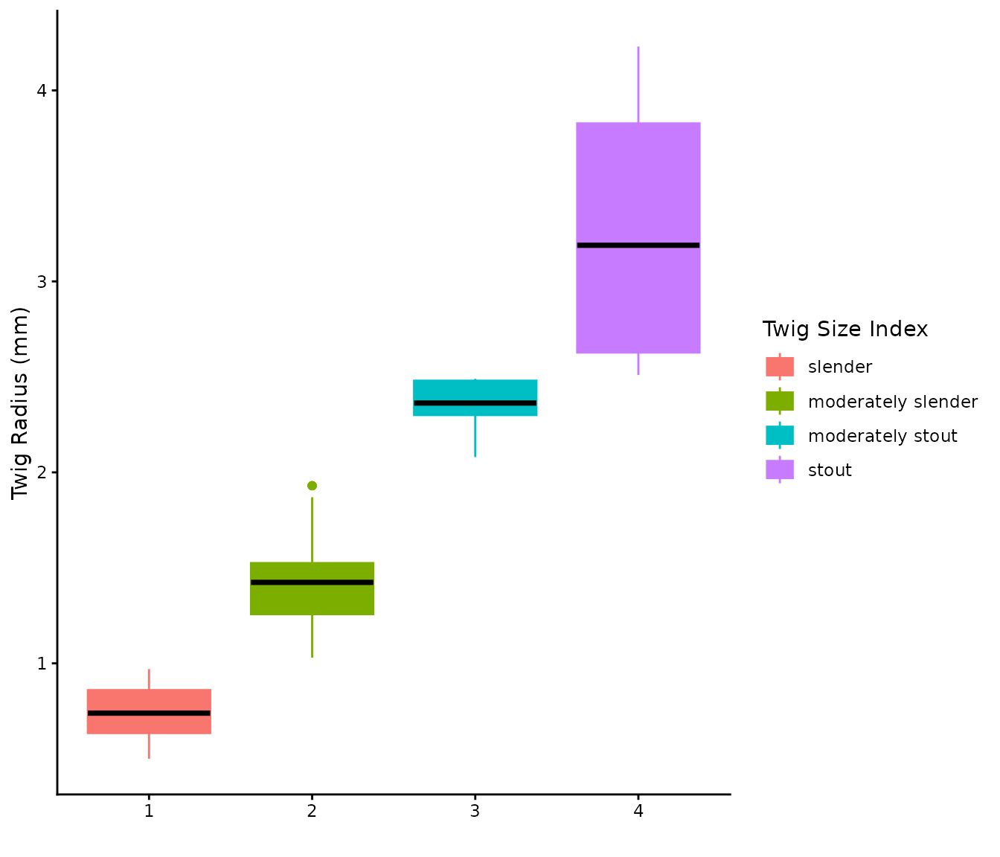

# Twigs

## Background

Twigs are the smallest above ground woody component of a tree. Twigs are
responsible for supporting the delicate tissues needed to grow leaves
and protect the buds during the dormant season. Because twig
measurements are the basis for the Real Twig method, and publicly
available databases of twigs are limited, we present a database of twig
measurements for a wide range of tree genera, species, and qualitative
indices.

## Recommendations

The twig radius is the most important part of Real Twig. We recommend
the following process of selecting a twig radius:

1.  Directly measure a twig on the focal tree whenever possible.

2.  If direct measurements are not possible, use a species specific
    measurement from the `twigs` database.

3.  If the species is not present in the database but the species is
    known, use a qualitative index describing the twig, such as
    *slender*, or *stout* (often found in many botanical manuals) to
    pick a radius from the `twigs_index` database.

4.  If none of the above are possible, use the genus average value from
    the `twigs` database.

The reason we advocate for a qualitative index over the genus average,
is that genera with many species can have a wide range of twig radii.
The qualitative index ensures the measurement is closer to the true
value than a potentially biased average. However, if the species in the
genera are similar the genus average can be used with good results
(Morales and MacFarlane 2024).

## Contributions

If you would like to contribute twig measurements to the twigs database,
please contact the package maintainer at <moral169@msu.edu>.

## Installation

You can install the package directly from
[CRAN](https://CRAN.R-project.org):

``` r
install.packages("rTwig")
```

Or the latest development version from [GitHub](https://github.com/):

``` r
devtools::install_github("https://github.com/aidanmorales/rTwig")
```

## Load Packages

The first step is to load the rTwig package.

``` r
library(rTwig)

# Useful packages
library(dplyr)
library(ggplot2)
```

## Twig Database

While the summarised twig database is built directly into rTwig, we can
load additional, raw measurements as follows:

``` r
twig_measurements <- rTwig::download_twigs(database = "all")
#> Downloading Twig Measurements
twig_measurements
#> $raw
#> # A tidytable: 1,456 × 5
#>    scientific_name radius_mm country region   institution              
#>    <chr>               <dbl> <chr>   <chr>    <chr>                    
#>  1 Abies concolor       1.14 USA     Michigan Michigan State University
#>  2 Abies concolor       1.40 USA     Michigan Michigan State University
#>  3 Abies concolor       1.65 USA     Michigan Michigan State University
#>  4 Abies concolor       1.65 USA     Michigan Michigan State University
#>  5 Abies concolor       1.78 USA     Michigan Michigan State University
#>  6 Abies concolor       1.78 USA     Michigan Michigan State University
#>  7 Abies concolor       1.78 USA     Michigan Michigan State University
#>  8 Abies concolor       1.90 USA     Michigan Michigan State University
#>  9 Abies concolor       1.52 USA     Michigan Michigan State University
#> 10 Abies concolor       1.14 USA     Michigan Michigan State University
#> # ℹ 1,446 more rows
#> 
#> $twigs
#> # A tidytable: 104 × 7
#>    scientific_name  radius_mm   min   max   std     n    cv
#>    <chr>                <dbl> <dbl> <dbl> <dbl> <dbl> <dbl>
#>  1 Abies concolor        1.43  0.89  1.9   0.28    21  0.19
#>  2 Abies spp.            1.43  0.89  1.9   0.28    21  0.19
#>  3 Acer platanoides      1.39  0.89  2.03  0.3     30  0.21
#>  4 Acer rubrum           1.18  0.89  1.52  0.16    30  0.14
#>  5 Acer saccharinum      1.41  0.89  1.9   0.27    14  0.2 
#>  6 Acer saccharum        1.2   0.89  1.65  0.23    30  0.19
#>  7 Acer spp.             1.29  0.89  2.03  0.23   104  0.18
#>  8 Aesculus flava        2.96  2.29  4.44  0.58    14  0.19
#>  9 Aesculus spp.         2.96  2.29  4.44  0.58    14  0.19
#> 10 Betula nigra          0.85  0.51  1.52  0.23    30  0.27
#> # ℹ 94 more rows
#> 
#> $twigs_index
#> # A tidytable: 4 × 7
#>   size_index         radius_mm     n   min   max   std    cv
#>   <chr>                  <dbl> <dbl> <dbl> <dbl> <dbl> <dbl>
#> 1 slender                 0.74    24  0.5   0.97  0.14  0.19
#> 2 moderately slender      1.42    60  1.03  1.93  0.23  0.16
#> 3 moderately stout        2.36    10  2.08  2.49  0.13  0.05
#> 4 stout                   3.19    10  2.51  4.23  0.71  0.22
```

The twigs database is broken into 7 different columns. *scientific_name*
is the specific epithet. Genus spp. is the average of all of the species
in the genus. *radius_mm* is the twig radius in millimeters. For each
species, *n* is the number of unique twig samples taken, *min* is the
minimum twig radius, *max* is the max twig radius, *std* is the standard
deviation, and *cv* is the coefficient of variation.

Let’s see the breakdown of species.

``` r
unique(twig_measurements$twigs$scientific_name)
#>   [1] "Abies concolor"               "Abies spp."                  
#>   [3] "Acer platanoides"             "Acer rubrum"                 
#>   [5] "Acer saccharinum"             "Acer saccharum"              
#>   [7] "Acer spp."                    "Aesculus flava"              
#>   [9] "Aesculus spp."                "Betula nigra"                
#>  [11] "Betula spp."                  "Carya cordiformis"           
#>  [13] "Carya ovata"                  "Carya spp."                  
#>  [15] "Castanea dentata"             "Castanea spp."               
#>  [17] "Cercis canadensis"            "Cercis spp."                 
#>  [19] "Cladrastis kentukea"          "Cladrastis spp."             
#>  [21] "Cornus mas"                   "Cornus officinalis"          
#>  [23] "Cornus spp."                  "Crataegus spp."              
#>  [25] "Fagus grandifolia"            "Fagus spp."                  
#>  [27] "Fagus sylvatica"              "Fraxinus americana"          
#>  [29] "Fraxinus pennsylvanica"       "Fraxinus quadrangulata"      
#>  [31] "Fraxinus spp."                "Ginkgo biloba"               
#>  [33] "Ginkgo spp."                  "Gleditsia spp."              
#>  [35] "Gleditsia triacanthos"        "Gymnocladus dioicus"         
#>  [37] "Gymnocladus spp."             "Gymnopodium floribundum"     
#>  [39] "Gymnopodium spp."             "Juglans cinerea"             
#>  [41] "Juglans nigra"                "Juglans spp."                
#>  [43] "Laguncularia racemosa"        "Laguncularia spp."           
#>  [45] "Larix laricina"               "Larix spp."                  
#>  [47] "Liquidambar spp."             "Liquidambar styraciflua"     
#>  [49] "Liriodendron spp."            "Liriodendron tulipifera"     
#>  [51] "Magnolia acuminata"           "Magnolia spp."               
#>  [53] "Malus spp."                   "Metasequoia glyptostroboides"
#>  [55] "Metasequoia spp."             "Nyssa spp."                  
#>  [57] "Nyssa sylvatica"              "Ostrya spp."                 
#>  [59] "Ostrya virginiana"            "Phellodendron amurense"      
#>  [61] "Phellodendron spp."           "Picea abies"                 
#>  [63] "Picea omorika"                "Picea pungens"               
#>  [65] "Picea spp."                   "Pinus nigra"                 
#>  [67] "Pinus spp."                   "Pinus strobus"               
#>  [69] "Platanus acerifolia"          "Platanus occidentalis"       
#>  [71] "Platanus spp."                "Populus deltoides"           
#>  [73] "Populus spp."                 "Prunus serotina"             
#>  [75] "Prunus spp."                  "Prunus virginiana"           
#>  [77] "Quercus acutissima"           "Quercus alba"                
#>  [79] "Quercus bicolor"              "Quercus coccinea"            
#>  [81] "Quercus ellipsoidalis"        "Quercus imbricaria"          
#>  [83] "Quercus macrocarpa"           "Quercus michauxii"           
#>  [85] "Quercus muehlenbergii"        "Quercus palustris"           
#>  [87] "Quercus robur"                "Quercus rubra"               
#>  [89] "Quercus shumardii"            "Quercus spp."                
#>  [91] "Quercus velutina"             "Rhizophora mangle"           
#>  [93] "Rhizophora spp."              "Thuja occidentalis"          
#>  [95] "Thuja spp."                   "Tilia americana"             
#>  [97] "Tilia spp."                   "Tilia tomentosa"             
#>  [99] "Tsuga canadensis"             "Tsuga spp."                  
#> [101] "Ulmus americana"              "Ulmus pumila"                
#> [103] "Ulmus rubra"                  "Ulmus spp."
```

Similarly, we also provide the same data base broken down by twig size
index. The size classes were adapted from (Coder 2021).

``` r
twig_measurements$twigs_index
#> # A tidytable: 4 × 7
#>   size_index         radius_mm     n   min   max   std    cv
#>   <chr>                  <dbl> <dbl> <dbl> <dbl> <dbl> <dbl>
#> 1 slender                 0.74    24  0.5   0.97  0.14  0.19
#> 2 moderately slender      1.42    60  1.03  1.93  0.23  0.16
#> 3 moderately stout        2.36    10  2.08  2.49  0.13  0.05
#> 4 stout                   3.19    10  2.51  4.23  0.71  0.22
```

## Visualization

Let’s visualize some of the twig data by oak species, and then by size
index.

    #> Ignoring unknown labels:
    #> • size : "Sample Size"



## References

Coder, Kim D. 2021. *Tree Anatomy Manual: Twigs*. Athens, GA: University
of Georgia Warnell School of Forestry & Natural Resources.

Morales, Aidan, and David W MacFarlane. 2024. “Reducing Tree Volume
Overestimation in Quantitative Structure Models Using Modeled Branch
Topology and Direct Twig Measurements.” *Forestry: An International
Journal of Forest Research* 98 (3): 394–409.
<https://doi.org/10.1093/forestry/cpae046>.
