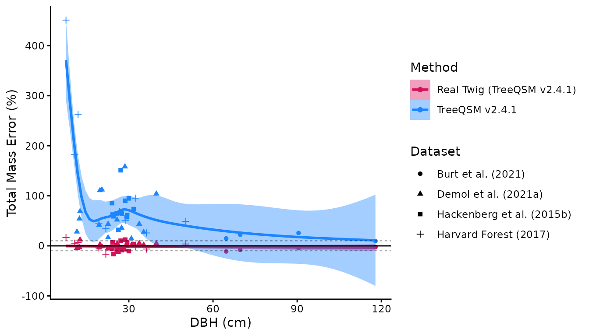
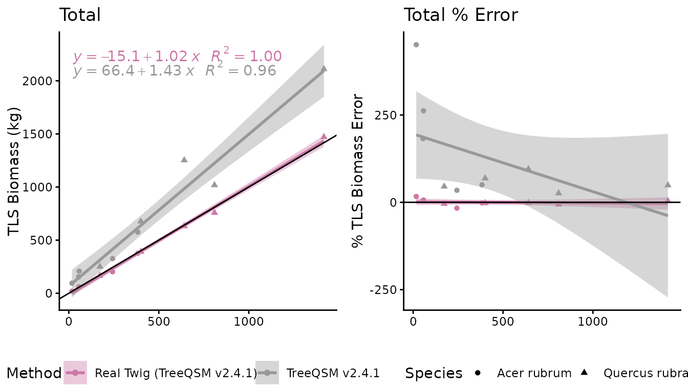
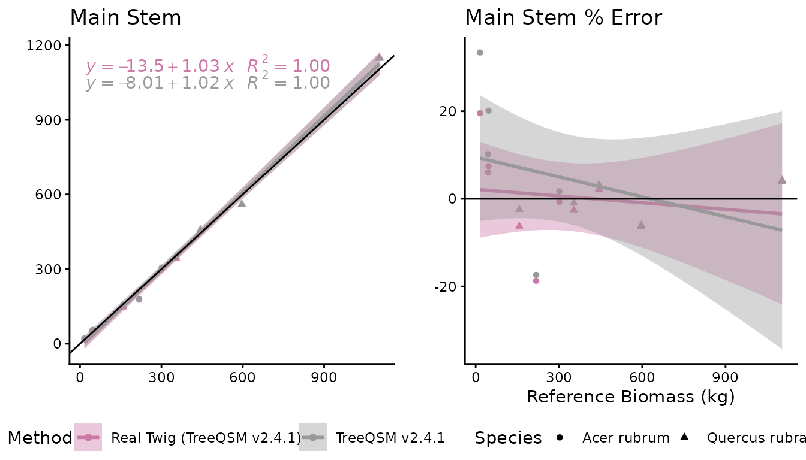
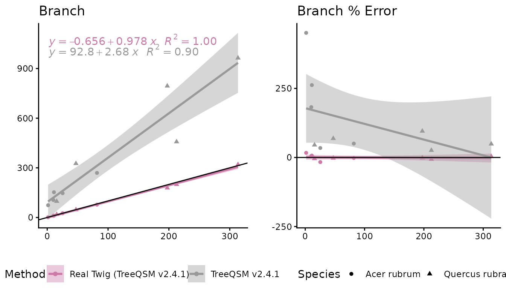
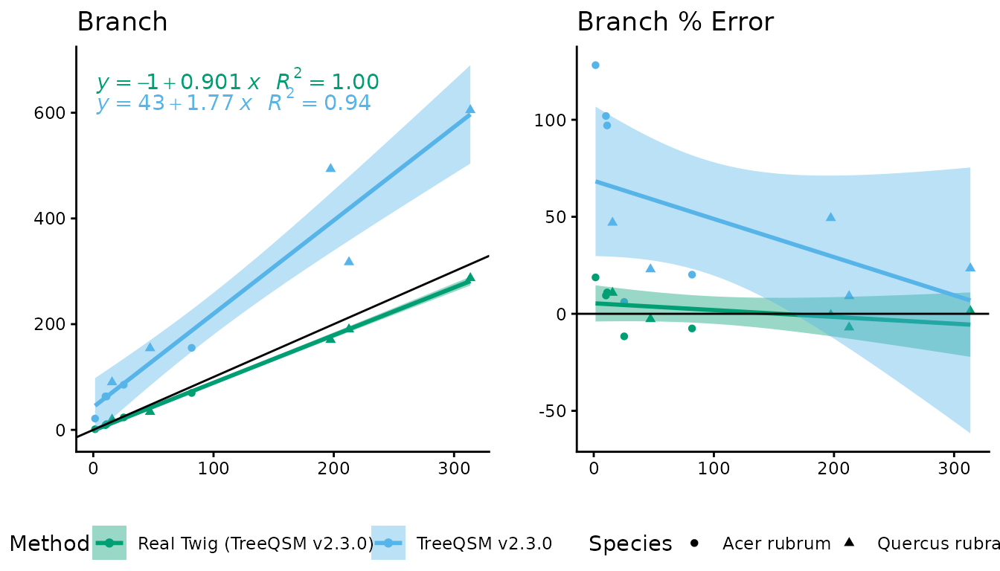
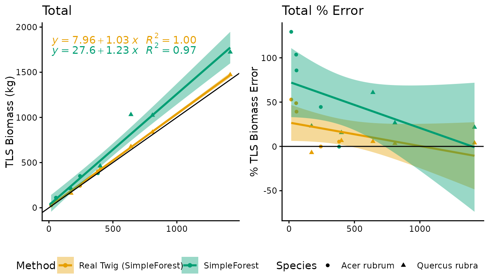
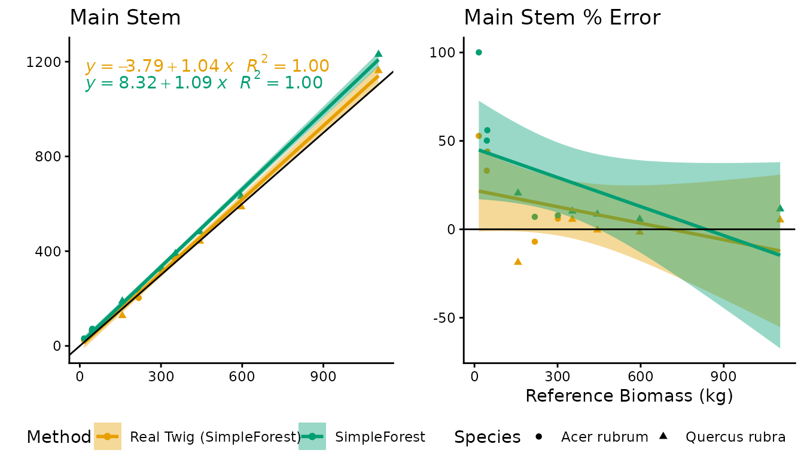

# Validation

How do we know if Real Twig returns accurate volume estimates? We
rigorously tested our method against multiple high quality reference
data sets that were both laser scanner and destructively sampled. The
laser scanning was done in leaf-off conditions with a Riegl VZ-400. We
used different versions of TreeQSM with the same input parameters per
tree and different data sets to test our method. A detailed discussion
of the results and implications can be found in *Morales & MacFarlane
(2024)*: <https://doi.org/10.1093/forestry/cpae046>

The graph and table below contain destructive sampling with total mass
and basic density (wood + bark) across four data sets, three of which
are publicly available and are linked below. The mass estimates and
statistics use TreeQSM v2.4.1 with its built in tapering compared to
Real Twig on the same QSMs.

- Burt et al. (2021): <https://zenodo.org/records/4056899>,
  <https://zenodo.org/records/4056903>

- Demol et al. (2021): <https://zenodo.org/records/4557401>

- Hackenberg et al. (2015b):
  <https://www.simpleforest.org/pages/dataQuercusPetraea.html>

| Method                     | Mean Relative Error (%) | RMSE (kg) | Relative RMSE (%) | CCC   |
|----------------------------|-------------------------|-----------|-------------------|-------|
| Real Twig (TreeQSM v2.4.1) | -1.190                  | 138.783   | 10.528            | 0.999 |
| TreeQSM v2.4.1             | 76.754                  | 641.746   | 48.683            | 0.982 |

## TreeQSM v2.4.1

The following figures look at the Harvard Forest data set using
different versions of TreeQSM. The destructive sampling data contains
total branch and main stem dry mass, and also basic density for both the
main stem and the branches. This allows us to test for compensating
errors, and look at the true differences between TreeQSM versions. We
used the same input parameters per tree and TreeQSM version to test our
model.

| TreeQSM v2.4.1          |                 |                   |                |
|-------------------------|-----------------|-------------------|----------------|
| Metric                  | Total Woody AGB | Main Stem Biomass | Branch Biomass |
| Mean Relative Error (%) | 126.428         | 4.581             | 949.317        |
| RMSE (kg)               | 325.973         | 22.217            | 317.471        |
| Relative RMSE (%)       | 77.672          | 6.773             | 346.454        |
| CCC                     | 0.831           | 0.998             | 0.381          |

| Real Twig (TreeQSM v2.4.1) |                 |                   |                |
|----------------------------|-----------------|-------------------|----------------|
| Metric                     | Total Woody AGB | Main Stem Biomass | Branch Biomass |
| Mean Relative Error (%)    | 0.019           | 0.493             | -0.691         |
| RMSE (kg)                  | 27.187          | 23.653            | 7.736          |
| Relative RMSE (%)          | 6.478           | 7.210             | 8.442          |
| CCC                        | 0.998           | 0.997             | 0.997          |

## TreeQSM v2.3.0

Below are the mass estimates and statistics using TreeQSM v2.3.0 with
its built in tapering and Real Twig applied to the same QSMs.

| TreeQSM v2.3.0          |                 |                   |                |
|-------------------------|-----------------|-------------------|----------------|
| Metric                  | Total Woody AGB | Main Stem Biomass | Branch Biomass |
| Mean Relative Error (%) | 50.529          | 1.204             | 363.772        |
| RMSE (kg)               | 156.127         | 23.138            | 146.843        |
| Relative RMSE (%)       | 37.202          | 7.053             | 160.249        |
| CCC                     | 0.947           | 0.997             | 0.654          |

| Real Twig (TreeQSM v2.3.0) |                 |                   |                |
|----------------------------|-----------------|-------------------|----------------|
| Metric                     | Total Woody AGB | Main Stem Biomass | Branch Biomass |
| Mean Relative Error (%)    | 2.198           | 4.700             | -9.095         |
| RMSE (kg)                  | 24.101          | 22.747            | 15.081         |
| Relative RMSE (%)          | 5.743           | 6.934             | 16.457         |
| CCC                        | 0.998           | 0.997             | 0.989          |

## SimpleForest

Real Twig was not tested with SimpleForest during its development. While
Real Twig does improve volume estimates for SimpleForest versus its
built in allometric corrections, there are still improvements to be
made, as SimpleForest QSM cylinders are generally much more
overestimated than TreeQSM cylinders, making the identification of
“good” cylinders difficult.

Below are the mass estimates and statistics using SimpleForest v5.3.2
with its built in vessel volume correction, and Real Twig applied to the
same QSMs.

| SimpleForest            |                 |                   |                |
|-------------------------|-----------------|-------------------|----------------|
| Metric                  | Total Woody AGB | Main Stem Biomass | Branch Biomass |
| Mean Relative Error (%) | 51.031          | 27.775            | 174.363        |
| RMSE (kg)               | 177.462         | 48.287            | 141.470        |
| Relative RMSE (%)       | 42.285          | 14.720            | 154.385        |
| CCC                     | 0.934           | 0.990             | 0.669          |

| Real Twig (SimpleForest) |                 |                   |                |
|--------------------------|-----------------|-------------------|----------------|
| Metric                   | Total Woody AGB | Main Stem Biomass | Branch Biomass |
| Mean Relative Error (%)  | 15.850          | 11.909            | 41.238         |
| RMSE (kg)                | 27.605          | 24.525            | 18.651         |
| Relative RMSE (%)        | 6.578           | 7.476             | 20.353         |
| CCC                      | 0.998           | 0.997             | 0.985          |
